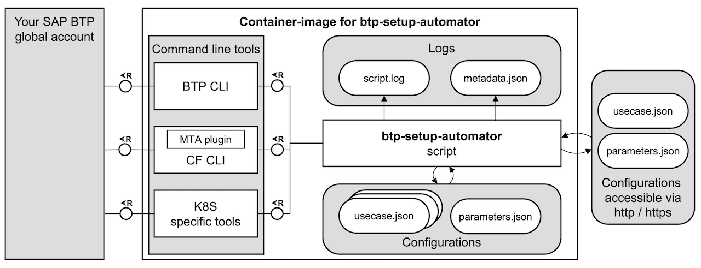
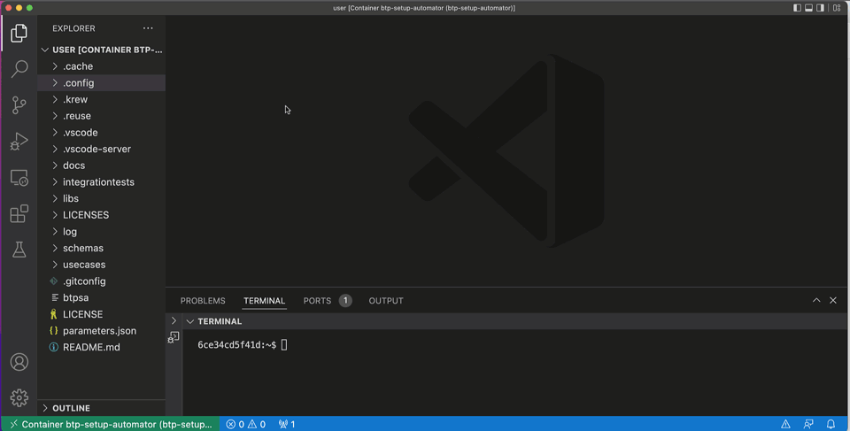
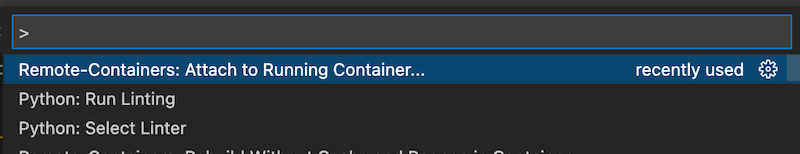
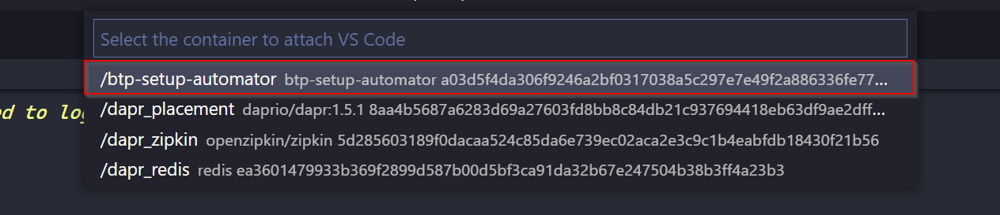

# Setup Automator for SAP Business Technology Platform

[](https://api.reuse.software/info/github.com/SAP-samples/btp-setup-automator) [](https://github.com/SAP-samples/btp-setup-automator/actions/workflows/docker-build-and-push.yml)

## Description

This repository provides the user with a script to **automate the setup** of an [SAP Business Technology Platform (SAP BTP) account](https://account.hana.ondemand.com/) and to **learn** how this is done with the various command line interfaces and tools that to run inside a [Docker](https://www.docker.com/) container.



This includes:

- Setup of your SAP BTP account
- Entitlement of services
- Subscriptions to applications and creation of service instances with service keys
- Addition of administrator users to global account and subaccounts
- Setup of roles and role collections, assignment of roles collections to users
- Deployment of complete applications
- Unrolling created setup

> Get a quick overview & demo of the btp-setup-automator through this video:
[](https://www.youtube.com/watch?v=3pLNXsn-cLM)

## Configuration

As a developer you configure your use case inside a `usecase.json` file with all services and subscriptions that you need (find some sample [use cases here](./usecases/released) including [their detailed descriptions](./docs/USECASES.md)). The [JSON schema **btpsa-usecase.json**](./libs/btpsa-usecase.json) makes it fairly simple to create your own use case file as you can see in this video:



You find more information on the sample use cases in the [use cases document](./docs/USECASES.md).

## Pre-requisites

To use the scripts, this is what you need to do first:

- Get an [SAP BTP trial account](https://cockpit.hanatrial.ondemand.com/trial/#/home/trial), or a [productive SAP BTP account](https://account.hana.ondemand.com/#/home/welcome) (recommended) where you can make use of the free tier service plans
- [Install a Docker engine](https://docs.docker.com/desktop/)

> ⚠ NOTE: Be aware of the terms of Docker for usage in enterprises. For details read [Docker is Updating and Extending Our Product Descriptions](https://www.docker.com/blog/updating-product-subscriptions/).

In case you are new to the containers topic, we **strongly recommended** that you install and setup **MS Visual Studio Code** (VS Code), too:

- [Install VS Code](https://code.visualstudio.com/download) - this will be your development environment.
- Install the VS Code [Dev Containers](https://marketplace.visualstudio.com/items?itemName=ms-vscode-remote.remote-containers) extension for connecting to and using Docker containers.

## Download and Run

Once the pre-requisites above are all met, you can either use the pre-built Docker image for the `btp-setup-automator`, or build it yourself.

### Option 1: Start Docker Container via Pre-Built Image (recommended)

This is the fastest way to use the `btp-setup-automator`. Open a terminal window on your machine and run the following command to pull the Docker image from the GitHub repository and start a container based upon it:

```bash
docker container run --rm -it --name "btp-setup-automator" "ghcr.io/sap-samples/btp-setup-automator:main"
```

Here's a brief explanation of the options used:

- `--rm` causes the container to be automatically cleaned up (removed) when you're done with it (when it stops)
- `-it` is short for `-i` `-t` and together make the container accessible and interactive (for you to work within)
- `--name` specifies a name for the container (rather than have Docker generate a random one)

> You may need to authenticate with GitHub's container registry at `ghcr.io` (you'll know you need to do this if you get a "denied" error when you run the above command). If this is the case, you'll need to [create a Personal Access Token (PAT)](https://github.com/settings/tokens) with the `read:packages` scope, and then run this command to log in, using the PAT as the password, when prompted:
>
> ```bash
> docker login ghcr.io --username <your GitHub username>
> ```

You'll notice that the prompt in your terminal has changed, because you are now working inside the Docker container that you just started.

You can now run the main script `btpsa` with the following command and you'll be deploying a CAP application on your SAP BTP Trial account (the [default use case](usecases/released/default.json)).

```bash
./btpsa
```

The tool starts to execute and the only thing you need to type in is your password for your SAP BTP account.

> 📝 Tip - If you are already using VS Code, you should execute this command instead, so that the container runs "detached" (`-d`) from your command line session:
>
> ```bash
> docker container run --rm -it -d --name "btp-setup-automator" "ghcr.io/sap-samples/btp-setup-automator:main"
> ```

You can also use the provided `run` files to pull the image from the registry and start the container via one command. To do so execute the following command (clone this repo to make the commands available to you):

- bash (macOS/Linux)

  ```bash
  ./run RunFromRegistry
  ```

- Command Prompt (Windows):

  ```cmd
  .\run.bat RunFromRegistry
  ```

- PowerShell Core (Cross Platform):

  ```powershell
  .\run.ps1 -RunFromRegistry $True
  ```

### Option 2: Start Docker Container With Self-Built Image

To create the Docker image yourself you need to execute these steps:

- Clone this GitHub repository to a local folder on your machine.
- Open the local folder in a terminal window on your machine (or in VS Code).
- Build the image with the following command:

  - bash (macOS/Linux)

    ```bash
    ./run
    ```

  - Command Prompt (Windows):

    ```cmd
    .\run.bat
    ```

  - PowerShell Core (Cross Platform):

    ```powershell
    .\run.ps1
    ```

The script will build a Docker image and create a running container from it, on your machine.

## Get the Docker Container up-and-running

Regardless of which option you chose, you should now see the Docker container up and running. In case you are using VS Code, open the command palette (Windows: `Ctrl+Shift+P` ; Mac: `Cmd+Shift+P`) and select the `Remote Containers: Attach to Running Container...` command:



> 📝 Tip - Don't forget to install the [Dev Containers extension](https://marketplace.visualstudio.com/items?itemName=ms-vscode-remote.remote-containers) in VS Code

Then look for the container by name (`btp-setup-automator`) and selecting it:



> You may see a message in VS Code informing you about the installation of some VS Code mechanisms into the container (to support the attachment to the remote container) and may have to wait a minute or two for this to complete.

## Using the Setup Automator

You can run the container directly via the terminal or within VS Code, modify use case file and parameter file or supply externally available use case and parameter file.

[Read the detailed instructions](docs/README.md) on how to setup your SAP BTP account for a use case with the `btp-setup-automator`.

### With VS Code

If you want a more detailed walk-through guiding you through the first steps with the btp-setup-automator and VS Code, then this video on YouTube is worth a look:

[](https://www.youtube.com/watch?v=BHBgQ45fgIk)

### From a terminal

You can also attach to the running container and execute a shell in there:

```bash
docker exec -it btp-setup-automator bash
```

You'll be placed in a new Bash shell inside the container, with access to all the tools:

```text
; docker exec -it btp-setup-automator bash
bash-5.1$ ls
LICENSE  LICENSES  README.md  btpsa  config  docs  generator  libs  parameters.json  tests  usecases
bash-5.1$ btp
Welcome to the SAP BTP command line interface (client v2.24.0)

Usage: btp [OPTIONS] ACTION GROUP/OBJECT PARAMS

CLI server URL:                    not set
User:                              not set
Configuration:                     /home/user/.config/btp/config.json

You are currently not logged in.

Tips:
    To log in to a global account of SAP BTP, use 'btp login'. For help on login, use 'btp help login'.
    To display general help, use 'btp help'.

bash-5.1$
```

## Known Issues

Checkout [the issues section in this repo](https://github.com/SAP-samples/btp-setup-automator/issues) for known and current issues.

## How to get Support?

❓ - If you have *question* you may peruse the [Frequently Asked Questions](docs/FAQ.md) document. If you did not find your questions answered there you can [ask a question in SAP Community](https://answers.sap.com/questions/ask.html).

🐛 - If you find a bug, feel free to [create an bug report](https://github.com/SAP-samples/btp-setup-automator/issues/new?assignees=&labels=bug&template=bug-report.yml&title=%5BBUG%5D+%3Ctitle%3E).

🚀 - If you have an idea for improvement or a feature request, please open [feature-request](https://github.com/SAP-samples/btp-setup-automator/issues/new?assignees=&labels=enhancement&template=feature-request.yml&title=%5BFEATURE+REQUEST%5D+%3Ctitle%3E).

## Contributions

Checkout the [CONTRIBUTING.md file](CONTRIBUTING.md) for more details on how to contribute to this open source project.

## Code of conduct

Checkout the [CODE_OF_CONDUCT.md file](CODE_OF_CONDUCT.md) for more details on the code of conduct for this open source project.

## License

Copyright (c) 2022 SAP SE or an SAP affiliate company. All rights reserved. This project is licensed under the Apache Software License, version 2.0 except as noted otherwise in the [LICENSE](LICENSES/Apache-2.0.txt) file.
