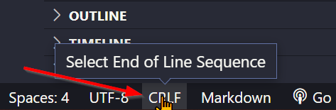
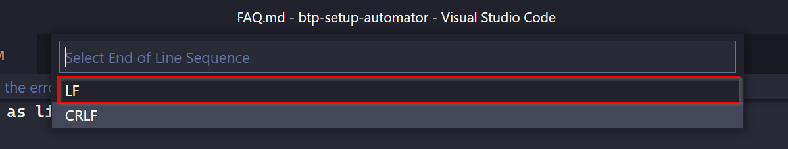
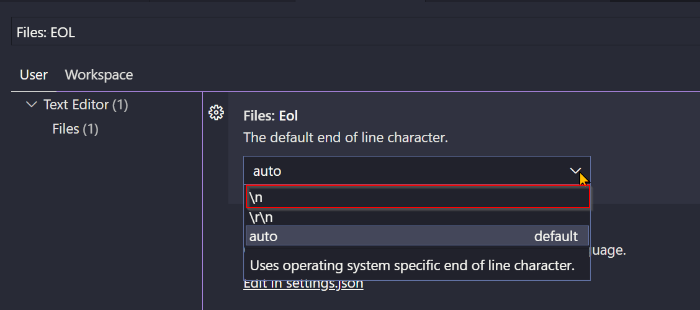

# Frequently Asked Questions (FAQ)

This is a set of questions and answers relating to the SAP Business Technology Platform (BTP) Setup Automator.

If you have other questions you can [ask a question in SAP Community](https://answers.sap.com/questions/ask.html) or [raise an issue](https://github.com/SAP-samples/btp-setup-automator/issues/new) as a feature request.

## Generic Topics

### How does this relate to the Boosters on SAP BTP?

According to [the Boosters documentation](https://help.sap.com/products/BTP/65de2977205c403bbc107264b8eccf4b/fb1b56148f834749a2bf51127421610b.html), boosters "are a set of guided interactive steps that enable you to select, configure, and consume services on SAP BTP to achieve a specific technical goal".

So they do share a similar purpose to the `btp-setup-automator`, but there are some fundamental differences:

* First, while guided interactive steps have their place, so do processes that can be automated and executed in an unattended fashion. The `btp-setup-automator` is designed to be usable in such automated environments, in continuous integration / continuous delivery (CI/CD) pipelines, in platform-wide setup scripts, and beyond.

* Then, there's the open source nature. A deliberate side-effect of making the `btp-setup-automator` available in this project is to demonstrate how to use the various command line interface (CLI) tools that work with SAP BTP, because that's how the actual setup work is achieved. Moreover, we want you to be able to create your own automation mechanisms using the project contents, to be inspired by it and to configure those mechanisms as much or as little as you want.

* Finally, because it's open source, and you're in control, you don't have to request a new booster from SAP or wait for one to be created for you.

### Why containers?

Containers are a great way to encapsulate independent sets of tools and configuration. What's more, that encapsulation can be made available to everyone regardless of their underlying platform. One of the biggest challenges of managing platforms, running development operations (DevOps) processes, and interacting with environments, is the setup and configuration required to do so at an individual level.

A container based approach levels the field and allows you to start working immediately without having to work through a boot load of prerequisites to get the basic tools in place.

> 📝 Tip - For more on how containers enable a better developer experience, but from a slightly different angle, you may be interested in the 3-part blog post series [Boosting tutorial UX with dev containers](https://blogs.sap.com/2022/01/27/boosting-tutorial-ux-with-dev-containers-part-1-challenge-and-base-solution/).

## Getting Started

### What do I need to get started?

See the [Requirements section of the main README](https://github.com/SAP-samples/btp-setup-automator#requirements) for details on what you need.

### How to login via SSO?

If you prefer you can set the parameter **loginmethod** to **sso** in the **parameters.json** file and the script will ask you to click on a URL when a login is needed (you have to open a browser with the link). This happens for logging-in via the SAP BPT CLI as well as for the Cloud Foundry CLI.

### Starting the `btpsa` script shows the error: `env: ‘python\r’: No such file or directory`

If you are using a windows machine there might be a default setup for the end of line sequence that is not compatible with Linux namely the `\r\n` as line breaks. To get rid of the error you have two options:

* Switch the end of line sequence setting in the VS Code window you opened via the shortcut the lower right corner of VS Code:

    

    This opens the command palette where you must choose `LF`

    

* Set the end of line sequence fixed to `\n` via `File` - `Preferences`- `Settings` - `Files:EOL`

    

## Cloud Foundry Setup Specifics

> 🚧 No FAQ yet 🚧

## Kyma Setup Specifics

> 🚧 No FAQ yet 🚧