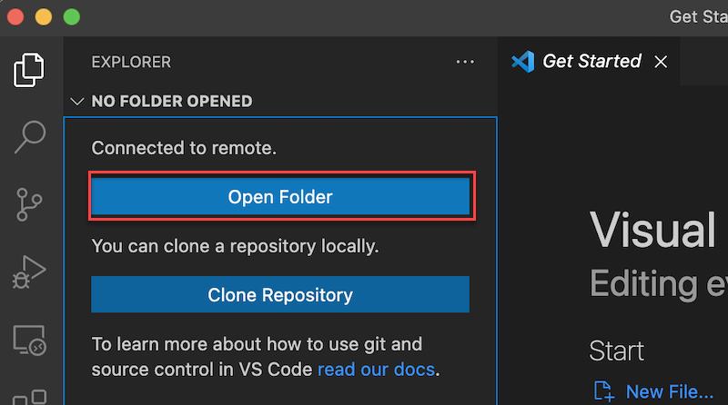
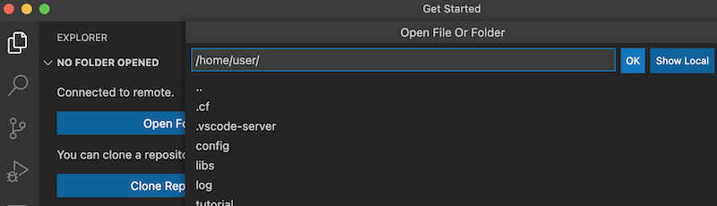
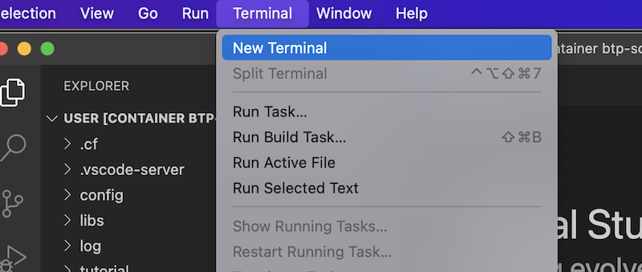
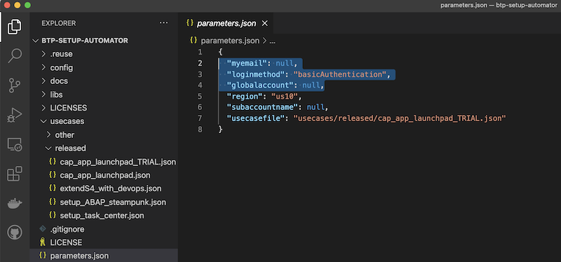
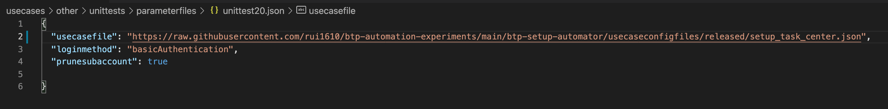

# Using btp-setup-automator

In case you are using VS Code (recommended), you need to open the Command Palette (in the menu "View" select "Command Palette") or press the key combination `Ctrl+Shift+P` (Windows) or `Cmd+Shift+P` (Mac). Then enter the command:

```text
Remote-Containers: Attach to Running Container
```


Now you should see the running container. Click on it, and a new window will pop-up with the content of the Docker container.


You might have to select folder with the content in navigation panel of VS Code via `Open Folder`:



Select the `/home/user` folder:



You can also open a new terminal in the container via the menu `Terminal` - `New Terminal`. This will open an `ash` shell.



The last step is to run the main script `btpsa` with the following command:

```bash
./btpsa
```

## Using Different Use Case Configurations

The script will take the parameters defined in the [**parameters.json** file](../parameters.json). By default the file is pointing to [a use case definition](../usecases/released/cap_app_launchpad.json) that sets up and deploys a full-stack CAP application on a BTP pay-as-you-go account.

You can use other use case files in the [**usecases** folder](../usecases/) or create your own use case file, by taking the existing ones as a blueprint and adapting the parameters:



In case you have your own use case files accessible via http, you can point to the use case file in your **parameters.json** file via its URL:



## Authentication

As a login to your SAP BTP account is required you must be authenticated. By default basic authentication is used for the SAP BTP and the Cloud Foundry CLI.

If you prefer you can set the parameter **loginmethod** to **sso** in the **parameters.json** file and the script will ask you to click on a URL when a login is needed (you have to open a browser with the link). This happens for logging-in via the SAP BPT CLI as well as for the Cloud Foundry CLI.

## Available Parameters

The `btp-setup-automator` script allows you to use parameters to configure it to your needs. This improves its usability when it comes to reuse in other scripts and/or in CI/CD pipelines.

Run the following command to get a list of the available commands of the `btp-setup-automator`:

```bash
./btpsa -h
```

This will give you an output like:

```bash
 usage: btpsa [-h] [-myemail MYEMAIL] [-globalaccount GLOBALACCOUNT] [-loginmethod LOGINMETHOD] [-region REGION] 
              [-subaccountid SUBACCOUNTID] [-subaccountname SUBACCOUNTNAME] [-subdomain SUBDOMAIN] [-org ORG] 
              [-orgid ORGID] [-cfspacename CFSPACENAME] [-iashost IASHOST] [-suffixinstancename SUFFIXINSTANCENAME] 
              [-fallbackserviceplan FALLBACKSERVICEPLAN] [-repeatstatusrequest REPEATSTATUSREQUEST] 
              [-repeatstatustimeout REPEATSTATUSTIMEOUT] [-usecasefile USECASEFILE] [-parameterfile PARAMETERFILE] 
              [-logfile LOGFILE] [-metadatafile METADATAFILE] [-logcommands LOGCOMMANDS] [-pruneusecase PRUNEUSECASE] 
              [-prunesubaccount PRUNESUBACCOUNT] [-mypassword MYPASSWORD] 

optional arguments:
  -h, --help                                  show this help message and exit
  -myemail MYEMAIL                            email address used for your SAP BTP account
  -globalaccount GLOBALACCOUNT                your SAP BTP global account
  -loginmethod LOGINMETHOD                    if set to sso, you'll need to open a link provided in a browser to login. 
                                              Set to basicAuthentication (default) the script will ask if you want 
                                              to provide username and password.
  -region REGION                              region of the subaccount for use case
  -subaccountid SUBACCOUNTID                  subaccount id for use case
  -subaccountname SUBACCOUNTNAME              subaccount name for use case
  -subdomain SUBDOMAIN                        subdomain of subaccount
  -org ORG                                    org name of the CF environment for use case
  -orgid ORGID                                org id of the CF environment for use case
  -cfspacename CFSPACENAME                    name for the Cloudfoundry space
  -iashost IASHOST                            IAS host for your SAP BTP sub account
  -suffixinstancename SUFFIXINSTANCENAME      suffix attached to each service instance created
  -fallbackserviceplan FALLBACKSERVICEPLAN    if defined, the tool will use the defined name as fallback service plan, 
                                              if the plan defined in the use case is not supported
  -repeatstatusrequest REPEATSTATUSREQUEST    time in seconds to wait after requesting status info (pulling)
  -repeatstatustimeout REPEATSTATUSTIMEOUT    timeout in seconds after which requests should be stopped
  -usecasefile USECASEFILE                    file with usecase config
  -parameterfile PARAMETERFILE                file to deliver all parameters within a single json file
  -logfile LOGFILE                            file for log information
  -metadatafile METADATAFILE                  file for log information
  -logcommands LOGCOMMANDS                    if set to True, the script will log all commands sent to the SAP BTP account. 
                                              If set to False it won't
  -pruneusecase PRUNEUSECASE                  if set to True: deletes all assets of a usecase based on the collected info
                                              in the metadatafile. No confirmation message. USE WITH CARE!!!
  -prunesubaccount PRUNESUBACCOUNT            if set to True: same like -pruneusecase, 
                                              but on-top deletes the subaccount. USE WITH CARE!!!
  -mypassword MYPASSWORD                      provide your BTP password via the command line. USE WITH CARE!!!
```

You find a more detailed description of the configuration options [here](./SAMPLECONFIG.md).

## Scripting BTP-Setup-Automator

As the `btp-setup-automator` is running in Docker there is a lot of potential to integrate it in other scripts that can call it.

Example: the developers of the `btp-setup-automator` test various use case configurations through a bash script similar to this example:

```bash
#!/usr/bin/env bash

folderLogFile="/your/local/folder/btp-setup-automator/log/$(date "+%Y-%m-%d")/"
mkdir -p "${folderLogFile}"
##########################################################################################################
# Run script with use case definition >integrationtest01<
##########################################################################################################
docker image build  -t "test01":latest -f "config/containerdefinitions/btp-setup-automator/Dockerfile"  .
docker container run --rm  -it -d --name "test01" \
    --mount type=bind,source="${folderLogFile}/",target="/home/user/log/" \
    "test01"

docker exec --workdir "/home/user/" "test01" btpsa \
    -parameterfile 'integrationtests/parameterfiles/integrationtest01.json' \
    -logfile       '/home/user/log/test01.log' \
    -metadatafile  '/home/user/log/test01_metadata.json' \
    -globalaccount '12345678trial-ga' \
    -loginmethod   'basicAuthentication' \
    -myemail       'steve.rodgers@starkindustries.com' \
    -mypassword    '$(cat cred.txt)'

docker container stop   test01
docker container wait   test01
docker container rm -f  test01
docker image     rmi -f test01
```

Let's go through this example step-by-step.

### Step1: Create a local folder for the logs

A folder on your local machine is used to let the docker image write the log files into. If the folder doesn't exist, yet, it will be created.

```bash
#!/usr/bin/env bash

folderLogFile="/your/local/folder/btp-setup-automator/log/$(date "+%Y-%m-%d")/"
mkdir -p "${folderLogFile}"
```

### Step 2: Build a Docker image for BTP-Setup-Automator

Afterwards a Docker image is build with the name **test01** based on the Dockerfile of `btp-setup-automator`:

```bash
docker image build  -t "test01":latest -f "config/containerdefinitions/btp-setup-automator/Dockerfile"  .
```

### Step 3: Start a Docker container with the created image

Now the docker container **test01** is created and started for the image **test01** we've created before. Mount the local folder of your machine to the folder of the `btp-setup-automator` log files to have a look into the log files.

```bash
docker container run --rm  -it -d --name "test01" \
                        --mount type=bind,source="${folderLogFile}/",target="/home/user/log/" \
                        "test01"
```

### Step 4: Run the BTP-setup-automator

The only thing missing now is to start the script for the `btp-setup-automator` that is inside the Docker container. Provide all the necessary parameters within a **docker exec** command.

```bash
docker exec --workdir "/home/user/" "test01" ./btpsa \
    -parameterfile 'integrationtests/parameterfiles/integrationtest01.json' \
    -logfile       '/home/user/log/test01.log' \
    -metadatafile  '/home/user/log/test01_metadata.json' \
    -globalaccount '12345678trial-ga' \
    -loginmethod   'basicAuthentication' \
    -myemail       'steve.rodgers@starkindustries.com' \
    -mypassword    '$(cat cred.txt)'
```

Once the script is ready, you can check your BTP global account, if all services and apps are up-and-running as expected. In addition you can check your local folder for the log files that have been created.

> 📝 Tip - In case you want to provide the parameter file as a link, you can do it like this:

  ```bash
  docker exec --workdir "/home/user/" "test01" ./btpsa \
      -parameterfile 'https://raw.githubusercontent.com/SAP-samples/btp-setup-automator/main/parameters.json' 
  ```

### Step 5: Clean-up

In a last step you stop the container, and once the container is stopped, you delete the container and the image:

```bash
docker container stop   test01
docker container wait   test01
docker container rm -f  test01
docker image     rmi -f test01
```

## Documentation of the parameters

As we have seen the setup-automator is configured via the `parameters.json` and the `usecase.json` files. These fies allow an extensive configuration of the setup-automator. You find the documentation of the possible parameters of the files here:

- `parameters.json`: [Link](./generated/btpsa-parameters.md)
- `usecase.json`: [Link](./generated/btpsa-usecase.md)

*Be ware that the documentation is generated via [JSON Schema Markdown Tools](https://github.com/adobe/jsonschema2md) which gives us some rough edges in the documentation when it comes to the allowed values.*

> 📝 Tip - The `parameters.json` and the `usecase.json` files are backed by a [JSON schema](https://json-schema.org/). This helps you when editing the files via type-ahead support, so no need to have the documentation open side-by-side to check for possible values. Indeed the documentation is generated based on the JSON schemas.
