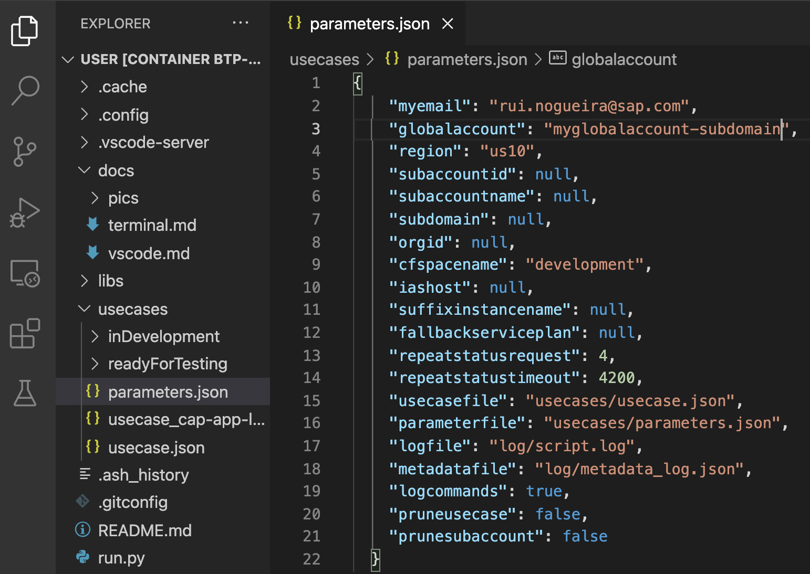

# Using the Dockerfiles in MS Visual Studio Code (VSCode)

In case you are using MS VS Code, you can press the key combination command, shift, P and enter the command:

```text
Remote-Containers: Attach to Running Container
```


Now you should see the running container. Click on it, and a new window will pop-up with the content of the docker container.


You might have to select the right folder in the left hand navigtion of VS Code. Simply select the /home/user folder.


Now the last step is to simply run the script with thw following command:

```bash
python run.py
```

The script will take the parameters defined in the [**parameters.json** file](../parameters.json). By default the [**parameters.json** file](../parameters.json) is pointing to use case definition that sets up and deploys a full-stack CAP application to a BTP trial account. But of course you can use other use case files in the [**usecases** folder](../usecases/) or even create your own use case file, by taking the existing ones as a blueprint.



## Authentication

As you have to login to the BTP account you have to be authenticated. By default basic authentication is used for the BTP and Cloudfoundry CLI. Bu if you prefer you can set the parameter **loginmethod** to **basicAuthentication** in the **parameters.json** file and the script will ask you to click on a URL when a login is needed (you have to open a browser with the link).

## Available parameters

The python script allows you to use parameters to configure it to your needs and make it better usable within other scripts and/or ci-cd pipelines. Just run the following command to get a list of the available commands:

```bash
python run.py -h
```

## Using different use case configurations

The folder **usecases** has several sample use case configurations that you can use with the script. By using the parameter **-usecase** you can tell the script to use another file than the default use case. Simply type the following command:

```bash
python run.py -usecase "usecases/released/usecase_cap-app-launchpad.json"
```

and the usecase will be executed to run the full-stack CAP application on a productive (e.g. Pay-per-Use) BTP account.

If you want you can as well use your own use case files that you can copy into the corresponding **usecases** folder BEFORE creating the docker image.
