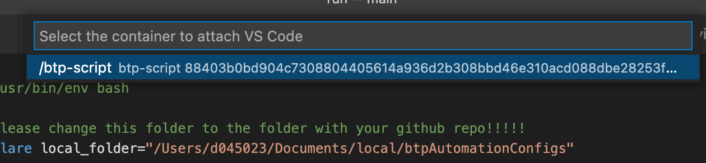
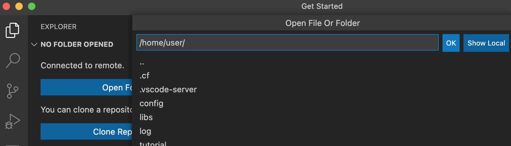
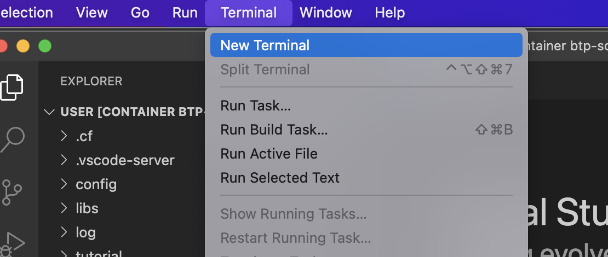

# Using the Dockerfiles in MS Visual Studio Code (VSCode)

In case you are using MS VS Code, you can press the key combination command, shift, P and enter the command:

```text
Remote-Containers: Attach to Running Container
```

 

Now you should see the running container. Click on it, and a new window will pop-up with the content of the docker container.

 

You might have to select the right folder in the left hand navigtion of VS Code. Simply select the /home/user folder.

 

 

 

Now the last step is to simply run the script with thw following command:

```bash
python run.py
```

## Authentication

The script will take the default use case **usecase.json** in the **usecase** folder to start with. But of course you can use other use case files or even create your own use case file.

As you have to login to the BTP account you have to be authenticated. By default SSO is used for the BTP and Cloudfoundry CLI. You have to copy and paste the URLs into your browser and the SSO will authenticate you. If this doesn't work simply set the parameter **loginmethod** to **basicAuthentication** and the script will ask you for your email adress and your password.

## Available parameters

The python script allows you to use parameters to configure it to your needs and make it better usable within other scripts and/or ci-cd pipelines. Just run the following command to get a list of the available commands:

```bash
python run.py -h
```

## Using different use cases

The folder **usecases** has several sample use case configurations that you can use with the script. By using the parameter **-usecase** you can tell the script to use another file than the default use case **usecases/usecase.json**. Simply type the following command:

```bash
python run.py -usecase "usecases/usecase_cap-app-launchpad.json"
```

If you want you can as well use your own use case files that you can copy into the corresponding **usecases** folder BEFORE creating the docker image.
