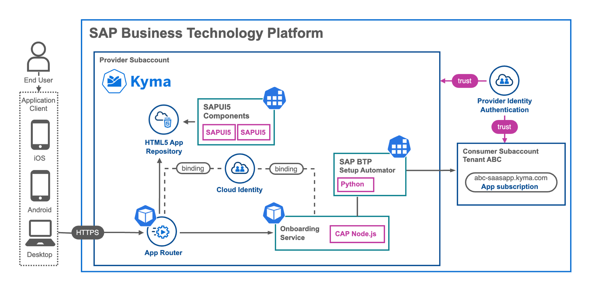
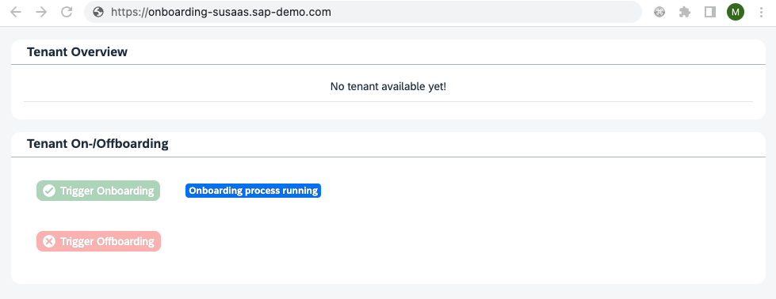
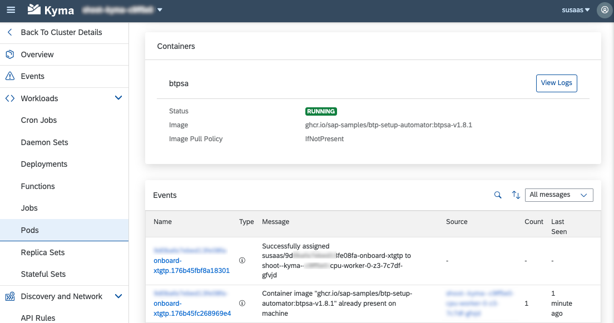
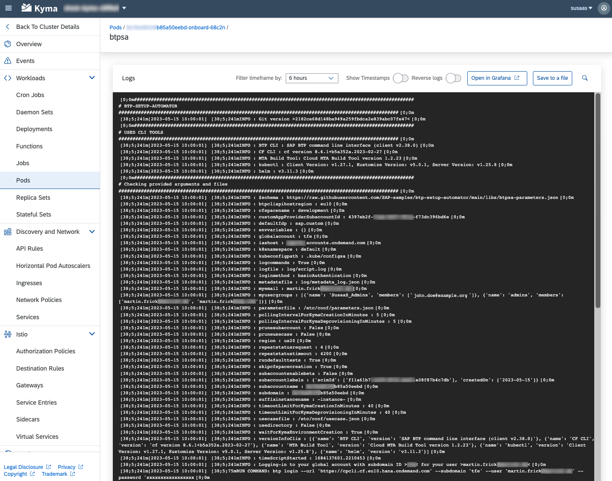

# SAP BTP SaaS Subscriber Tenant Onboarding using the btp-setup-automator

The [btp-setup-automator](https://github.com/SAP-samples/btp-setup-automator) is an open source project to help developers setting-up their SAP BTP accounts quickly via various command line interfaces. In this scenario, the **btp-setup-automator** is being used in the context of building Software-as-a-Service (SaaS) applications using the SAP Business Technology Platform. 

Especially in partner and large customer contexts, the adoption of multitenant SaaS solutions can significantly reduce total cost of ownership (TCO) and create new revenue streams for reusable business applications. However, as the number of customers intending to use your SaaS solution grows, it also brings forth considerable automation potential. Read on to discover how **btp-setup-automator** simplifies one central and crucial automation aspect, enabling you to streamline processes effectively.

Find more details in our blog post on **[SaaS Self-Onboarding and One-Domain Concept in SAP BTP, Kyma Runtime using CAP](https://blogs.sap.com/2023/06/01/saas-self-onboarding-and-one-domain-concept-in-sap-btp-kyma-runtime-using-cap/)**.

## Context

One of the primary concerns for Software-as-a-Service (SaaS) providers is the time-consuming process of onboarding new SaaS subscribers. May it be for a **trial** or even a **paid** version of a SaaS offering. Creating Subaccounts, triggering subscriptions, and assigning roles can be tedious and repetitive. To address this challenge, it is essential to streamline the onboarding process for new SaaS customers when developing multitenant applications on platforms like SAP Business Technology Platform. The objective is to enable customers to effortlessly subscribe to SaaS offerings at any time, from anywhere in the world. By prioritizing automation, SaaS providers can significantly improve operational efficiency and enhance the customer experience. Simplifying the onboarding process allows for seamless scalability and a smoother adoption journey for customers.

As part of our commitment to supporting our partners and customers in their SaaS application development journey on SAP BTP, we are pleased to offer a sample implementation for this specific requirement. This implementation harnesses the power of the **btp-setup-automator**, which seamlessly integrates into the self-registration and onboarding process. By dynamically generating the parameter and usecase JSON files at runtime, we ensure that all essential subscriber-specific details are included for the successful setup of their respective Subaccounts. The sample files provided in this documentation are intended to facilitate a deeper comprehension of the automation capabilities and processes involved.

As of today, we implemented this sample scenario leveraging the **SAP BTP, Kyma Runtime**. Nevertheless, a similar approach can also be used in a **Cloud Foundry** environment, as the usage Docker Containers is also supported here. 


## SAP BTP, Kyma Environment

In this particular use-case, we present a distinctive approach compared to the other use-cases available within the **btp-setup-automator** repository. Our focus lies on showcasing the extensive capabilities of using the btp-setup-automator directly within an existing CAP service, operating as a Kubernetes Job within a Kyma Cluster. To streamline the entire setup process and eliminate the need for creating your own btp-setup-automator Container Image, we leverage the publicly available *btp-setup-automator* container image and dynamically generate a corresponding Kubernetes Job on demand. This highlights the true elegance of developing applications on Kyma, where reliance on the btp-setup-automator becomes seamless.

Given that we already operate within a Kubernetes environment, we can effortlessly utilize the features of the setup automator (which essentially manifests as a Docker Image) with minimal effort. By combining it with the robust capabilities of the Kubernetes API, a plethora of ad-hoc automation scenarios unveil themselves, all while operating within the familiar confines of our beloved CAP framework. This framework provides us with reliable user authentication details, a REST interface to trigger the Self-Onboarding process from the user interface, and an array of other SAP BTP Service Integrations if needed.

This holistic integration of btp-setup-automator within our Kubernetes environment, along with the innate capabilities of our CAP framework, opens up exciting possibilities for achieving seamless and efficient automation within Software-as-a-Service scenarios. The high-level architecture diagram below illustrates the automation approach combined with a self-registration option for new SaaS customers.

[](./images/Arch_SelfReg.png?raw=true)

The entire onboarding process can be initiated by SaaS consumers following their successful registration with SAP Identity Authentication Service, employing a self-service approach. By selecting specific buttons within a dedicated SAPUI5 freestyle user interface, the CAP Service implementation will be invoked on behalf of the authenticated user.

[](./images/Obd_UserInterface.png?raw=true)

To facilitate the desired functionality, our CAP service will dynamically employ a new Kubernetes Job (leveraging the Kubernetes API) to instantiate a new Pod within the Kyma Cluster. This Pod utilizes the btp-setup-automator container image. By leveraging the individual SaaS customer details (available for the authenticated user), such as email or SCIM User ID, the commands executed within this dedicated container are straightforward. The integration with the CAP framework, which supports a binding to the SAP Identity Authentication Service, ensures the secure utilization of authenticated user details. Moreover, it provides the opportunity to leverage additional SAP BTP services, such as SAP HANA Cloud database, if necessary.

```js
await k8sBatchV1Api.createNamespacedJob( kymaNamespace, 
    {
        apiVersion: 'batch/v1',
        kind: 'Job',
        metadata: { name: tenantId + '-onboard' },
        spec: {
            ttlSecondsAfterFinished: 10,
            template: {
                metadata: { 
                    name: tenantId + '-onboard', 
                    annotations: { "sidecar.istio.io/inject": "false" } 
                },
                spec: {
                    restartPolicy: 'Never',
                    containers: [{
                        image: 'ghcr.io/sap-samples/btp-setup-automator:btpsa-v1.8.1',
                        name: 'btpsa',
                    ...
```

In this simplified example, the process commences by dynamically generating customer-specific usecase.json and parameters.json files, which are stored within the file system of the running btp-setup-automator container. Subsequently, the **btpsa** command in the same directory is executed, referencing these files. This seamless orchestration guarantees an efficient and adaptable setup process for each customer. By dynamically generating the required configuration files and executing the necessary commands, we optimize the overall setup procedure, ensuring a streamlined experience.

[](./images/Obd_PodDetails.png?raw=true)
[](./images/Obd_PodLogs.png?raw=true)

For the Onboarding, the usage of the **btp-setup-automator** includes a plethora of different actions on the SAP BTP side like:

1) Setting up a **Subaccount** with a generic ID and subdomain based on the authenticated SaaS customer SCIM ID
2) Creating a **Subscription** to the Software-as-a-Service offering in the Subscriber Subaccount
3) Configuring a **Trust** with the central SAP IAS (Identity Authentication Service) managed by the SaaS provider
4) Assigning a **Subaccount Adminstrator** for the SaaS provider to administrate the new Subaccount
5) Assigning the **SaaS Admin Role Collection** for the Subscriber Administrator to access the SaaS solution
6) Assigning the **Subaccount Viewer** permission to the Subscriber Administrator for SAP BTP platform access
7) Creating a **Service Instance** for the Service Broker registration configured during the SaaS subscription
8) Creating a **Service Binding** for the new Service Instance consumable by the SaaS subscriber

You can find further details in the following CAP Service of our sample project, covering the described steps as part of the **onboardTenant** function.

<https://github.com/SAP-samples/btp-cap-multitenant-saas/blob/main/docu/4-expert/-Kyma-/saas-self-onboarding/files/code/srv/obd-service.js>

```yaml
command: [
    "/bin/sh", 
    "-ec",
    `echo '{ 
        "services": [ { 
            "name": "susaas-default-a1b2c3d", ## <-- SaaS solution offering
            "category": "APPLICATION", 
            ...
        }], 
        "assignrolecollections": [ 
            { "name": "Subaccount Administrator", "type": "account", ... }
        ], 
        "executeAfterAccountSetup": [  
            { "description": "Setup SAP IAS trust", "command": "btp create security/trust ... "  }
        ]  
    }' > 'obdusecase.json'
    && echo '{ 
        "region": "us20", 
        "Subaccountname": "c79066a3986649f1b", ## <-- Dynamic Id for new SaaS customer
        "subdomain": "c79066a3986649f1b", ## <-- Dynamic Subdomain for new SaaS customer
        ...
    }' > 'obdparameters.json'
    && ./btpsa 
        -usecasefile 'obdusecase.json'
        -parameterfile 'obdparameters.json'
        ...
]
```

Upon successful completion of the Job, which encompasses the setup of the new Subaccount along with all the necessary objects and configurations, an automated cleanup process takes place within the Kyma cluster. This process ensures the removal of both the Kubernetes Job and the associated Pod, thereby maintaining a clean and efficient environment. Also the Offboarding process for SaaS customers is supported in a Self-Service manner. Once a SaaS customer decides to offboard and delete his SaaS subscription, a similar Kubernetes Job is spinned up by CAP (leveraging the Kubernetes API), which will run the following tasks:

1) Deleting the **Service Binding** that was created for the Service Instance
2) Deleting the **Service Instance** before the actual SaaS solution is unsubscribed
3) Pruning the **Subaccount**, which will automatically delete the SaaS subscription

**Important** - It is essential, to delete the API Service Binding and Service Instance before pruning the Subaccount or deleting the SaaS subscription. The SaaS offboarding logic will automatically delete the Service Broker Registration from the respective Subaccount, which will make it impossible to delete respective Service Instances afterwards!

You can find further details in the following CAP Service of our sample project, covering the described steps as part of the **offboardTenant** function. 

<https://github.com/SAP-samples/btp-cap-multitenant-saas/blob/main/docu/4-expert/-Kyma-/saas-self-onboarding/files/code/srv/obd-service.js>

This is a streamlined method for offboarding a SaaS tenant, employing the **btp-setup-automator** with a nearly empty **usecase.json** file. The effective "offboarding" and deletion of the SaaS subscription and the associated consumer Subaccount are facilitated through the **pruneSubaccount** flag in the **parameters.json** file. In a sophisticated setup where a subscriber Subaccount serves multiple SaaS solutions, the option of deleting the entire Subaccount may not align with your requirements.

**Further information**

To explore further details on using the btp-setup-automator, we recommend referring to the SAP-samples GitHub repository. Within the repository, you will find a comprehensive step-by-step guide that walks you through the process. Additionally, a SaaS sample application is provided, which serves as a practical example for implementing the automation using the btp-setup-automator.

The guide in the repository offers detailed instructions, ensuring a clear understanding of the setup and usage of the btp-setup-automator. By following the steps outlined in the guide, you can effectively leverage the automation capabilities and adapt them to your specific requirements. We encourage you to explore the SAP-samples repository for a hands-on experience with the **btp-setup-automator**.

[SAP-samples - Develop a multitenant Software as a Service application in SAP BTP using CAP](https://github.com/SAP-samples/btp-cap-multitenant-saas)

[Expert Scope - Self-Registration, Onboarding Automation and One-Domain Concept](https://github.com/SAP-samples/btp-cap-multitenant-saas/tree/main/docu/4-expert/-Kyma-/saas-self-onboarding)

We invite you to explore the corresponding blog post, which offers valuable insights into the Subaccount onboarding automation and self-registration process and the workings of the btp-setup-automator when integrated into a new Kyma/Kubernetes Job. The blog post includes a collection of screenshots that provide a visual representation of the self-registration experience and offer a glimpse into the underlying processes.

[Blog post - SaaS Self-Onboarding and One-Domain Concept in SAP BTP, Kyma Runtime using CAP](https://blogs.sap.com/2023/06/01/saas-self-onboarding-and-one-domain-concept-in-sap-btp-kyma-runtime-using-cap/)


## SAP BTP, Cloud Foundry Environment

An analogous automation strategy employing the **btp-setup-automator** can be realized through the utilization of Cloud Foundry **Tasks**. With Cloud Foundry's capacity to execute Docker Containers, it becomes feasible to execute a specialized Task using a Docker Image, such as the btp-setup-automator, and provide it with the requisite particulars pertaining to the SaaS subscriber. A respective code sample and documentation might follow in the future. Once you pushed a new app to your Cloud Foundry environment based on the setup automator Container Image, you can just run a Cloud Foundry Task and execute commands based on this application. 

```http
POST https://api.cf.eu10.hana.ondemand.com/v3/apps/8dd76b82-aeca-4bfb-aec5-21a0f3e2fab7/tasks

{ 
    "command": "cd home/user/ && ./btpsa",
    "memory_in_mb": 256
}
```
