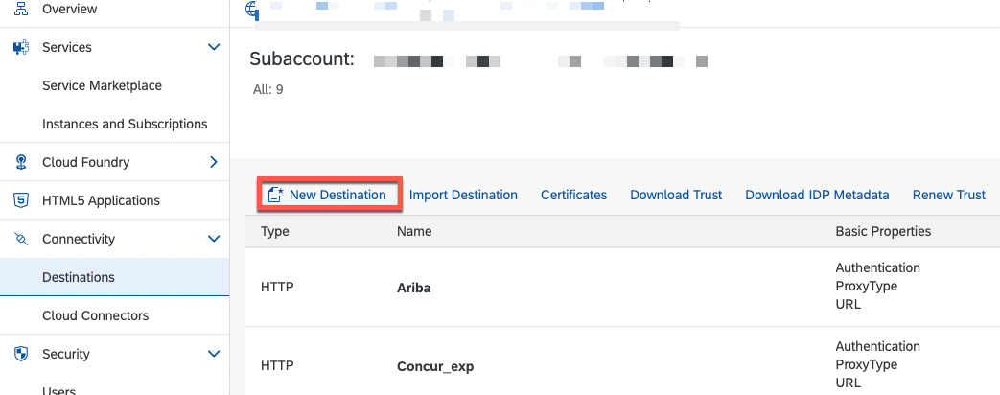
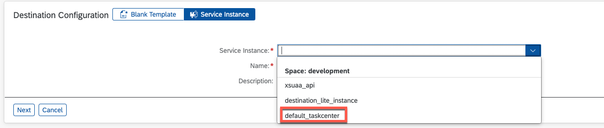
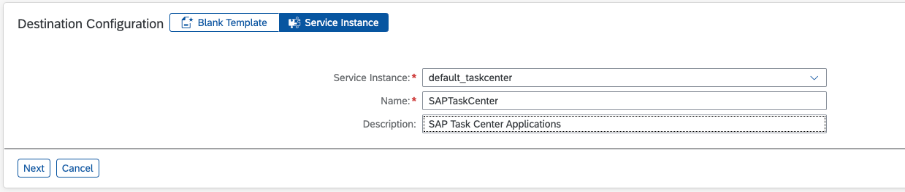
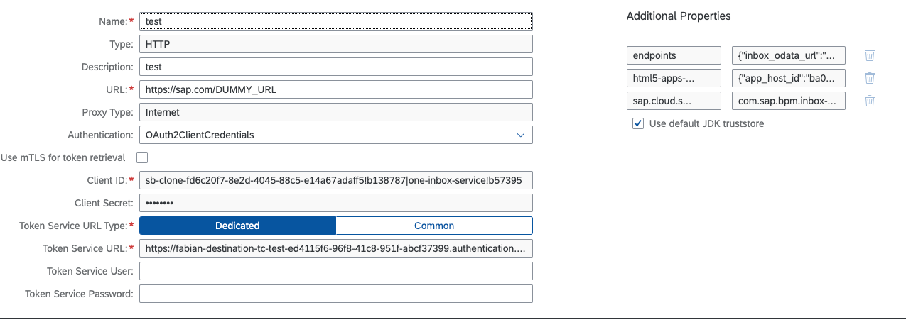

# Instructions how to create a destination to provide the SAP Task Center applications

In the BTP Cockpit navigate to "Security > Destinations" and click on **"New Destinations"**:

In the "Destination Configuration" on the bottom, choose **"Service Instance"** and select the SAP Task Center service instance:

Provide a name:

Click **"Next"**, you should now see the details of the Destination:

Save your changes.

To verify the success of the creation and availability of the SAP Task Center application you can select the **"HTML 5 Applications"** entry.
You should now identify two applications:

